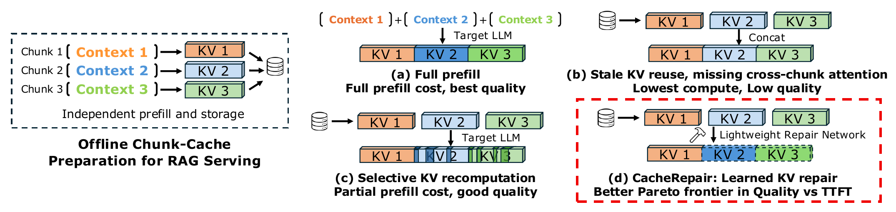
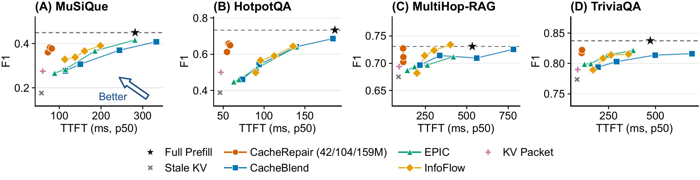

# CacheRepair

[Paper](https://arxiv.org/abs/2609.35139) | [Code](https://github.com/genglinWang/CacheRepair-code) | [Models](https://huggingface.co/gwang3456/cacherepair)

**Learning to Repair Cross-Chunk Context in RAG for KV Cache Fusion**

CacheRepair is a small external network that reconstructs cross-chunk context
in independently precomputed KV caches. It predicts the residual from stale
KV to joint-prefill KV while keeping the target LLM frozen. One repairer serves
all four downstream datasets: MuSiQue, HotpotQA, MultiHop-RAG, and TriviaQA.

| Target LLM | Small | Medium | Large |
|---|---:|---:|---:|
| Qwen2.5-3B-Instruct | 9M | 30M | 51M |
| Llama-3.1-8B-Instruct | 23M | 59M | 93M |
| Qwen2.5-14B-Instruct | 42M | 104M | 159M |

The [Hugging Face models](https://huggingface.co/gwang3456/cacherepair) contain
repair weights and their normalization statistics. Obtain the matching target
LLM from its official repository, including the required Llama access approval.

## Overview and results



**Figure 1.** CacheRepair uses a lightweight network to repair independently precomputed document KV caches.



**Figure 2.** Answer F1 versus p50 TTFT for Qwen2.5-14B on four downstream datasets. See the [paper](https://arxiv.org/abs/2609.35139) for the evaluation settings.

## Quick tutorial

**Install.** Use Linux with an NVIDIA GPU for evaluation. The paper uses one
80-GB A800 per run, PyTorch 2.6, Transformers 4.57.6, and vLLM 0.8.5. Each run
loads the target LLM for offline chunk precomputation and for serving; an 80-GB
GPU accommodates the provided configurations. From this repository:

```bash
python -m pip install -e '.[eval]'
```

**Build the inputs.** Download the original dataset files listed in
[Data preparation](docs/DATA.md). The builder uses the supplied 500 IDs to
restore the paper's document order, tokenization, and chat template. For example:

```bash
python -m cacherepair.data --dataset musique --target qwen3 \
  --source sources/musique_ans_v1.0_dev.jsonl \
  --qwen-tokenizer Qwen/Qwen2.5-3B-Instruct \
  --output inputs/qwen3/musique.json
```

**Evaluate.** The following command downloads the three matching repairers
and runs Full Prefill, Stale KV, and CacheRepair S/M/L on the same inputs.
Use `--method repair --size M` to run just the medium repairer. `--weights`
also accepts a local directory containing the downloaded model subdirectories.

```bash
python -m cacherepair.evaluate --model Qwen/Qwen2.5-3B-Instruct \
  --manifest inputs/qwen3/musique.json --method all \
  --weights gwang3456/cacherepair --gpu 0 --output outputs/qwen3/musique
```

Each run writes answer text, generated token IDs, F1, EM, and first-token
latency to `rows.jsonl`, plus a small configuration file and aggregate summary.
F1 and TTFT come from the same generation. TTFT includes host-to-device cache
transfer, repair, global RoPE, query processing, and first-token generation;
offline chunk prefill and pinned-host preparation precede timing. Evaluation
uses greedy decoding, a 32-token output limit, and concurrency one. GPU kernels
are warmed before measurement. Measured latency depends on the host and GPU.

**Draw the figures.** Repeat construction and evaluation for the four datasets
and the three target LLMs, using `--target qwen3`, `llama8`, or `qwen14` when
building inputs. Then run:

```bash
python -m cacherepair.plot --results outputs --output outputs/figures
```

This produces `metrics.csv` and three four-panel PDF/PNG figures, with the
five operating points generated by this repository. Add `--intervals` to show
request-bootstrap F1 intervals. Full Prefill uses the complete document prefix;
Stale KV reuses independently computed caches; CacheRepair adds learned repair.

## Use a repairer in Python

`load_repairer` accepts a Hugging Face repository or a local model directory.
The target LLM supplies its frozen token embeddings and native RoPE parameters.
Here `chunks` is a list of token-ID lists for one document prefix:

```python
import torch
from transformers import AutoModelForCausalLM
from cacherepair import load_repairer
from cacherepair.cache import compile_stale, materialize, to_hf_cache

target = AutoModelForCausalLM.from_pretrained(
    "Qwen/Qwen2.5-3B-Instruct", torch_dtype=torch.bfloat16,
    attn_implementation="eager").to("cuda").eval()
repairer = load_repairer(
    "gwang3456/cacherepair", target,
    subfolder="Qwen2.5-3B-Instruct/M").to(dtype=torch.bfloat16)

stale, tokens, chunk_ids = compile_stale(target, chunks)
repaired = repairer.repair(stale.to(torch.bfloat16), tokens, chunk_ids)
rotary = target.model.rotary_emb
global_kv = materialize(repaired, rotary.inv_freq, rotary.attention_scaling)
past_key_values = to_hf_cache(global_kv)
```

The resulting cache is ready for query processing at positions starting after
the document prefix. The evaluation entry point handles this step with vLLM.
Packed repair tensors have shape `[batch, tokens, layers, KV heads, 2, head dim]`;
the `2` axis holds K and V. This Python example uses exact-mask SDPA; the serving
entry point uses the paper's mixed FlexAttention/SDPA policy.

## Train on your corpus

Prepare JSONL records of the form `{"chunks": [[token IDs], [token IDs], ...]}`
with the matching target tokenizer. The training entry point computes stale and
joint caches on demand, estimates per-coordinate RMS statistics, and minimizes
residual-normalized MSE. The target LLM stays frozen. For example:

```bash
python -m cacherepair.train --model Qwen/Qwen2.5-3B-Instruct \
  --data training_tokens.jsonl --config configs/Qwen2.5-3B-Instruct-M.json \
  --epochs 6 --schedule-epochs 8 --output outputs/training
```

The paper uses 50,000 generic retrieval examples, an effective batch of four,
AdamW, and 75,000 updates on a 100,000-update learning-rate schedule. The schedule
horizon is preserved by `--schedule-epochs 8`. This entry point applies the same
architecture and objective to your supplied corpus; the published models are
ready for the main evaluation. Details are in [Training](docs/TRAINING.md).

## Code map

| File | Role |
|---|---|
| `model.py` | StaleEncoder, block-causal repair blocks, reinjection, residual head, model loading |
| `cache.py` | Chunk prefill, canonical K conversion, joint supervision, global RoPE |
| `data.py` | Source adapters, MultiHop-RAG retrieval, fixed-ID input construction |
| `train.py` | RMS statistics and residual-MSE training |
| `evaluate.py` | Generation, F1/EM, TTFT, all five operating points |
| `connector.py` | Pinned-host transfer and repaired KV injection into vLLM |
| `plot.py` | Result aggregation and three quality–TTFT figures |

`__init__.py` exports the API; `sitecustomize.py` registers the connector in
spawned vLLM workers. The implementation comprises nine Python files.

## License

CacheRepair code is licensed under [Apache-2.0](LICENSE). Repairer weights have
target-specific terms described in the [model repository](https://huggingface.co/gwang3456/cacherepair/blob/main/LICENSE).
Obtain target LLMs and datasets from their original providers under their
respective licenses. See [NOTICE](NOTICE) for model attribution.

## Version and citation

This release pairs code version `1.0.0` with the nine repairers
listed in `manifest.json` in the model repository and
[arXiv v1](https://arxiv.org/abs/2609.35139v1) (September 28, 2026).
For reproducible runs, retain the code commit and the model repository revision.

```bibtex
@misc{wang2026cacherepair,
  title={CacheRepair: Learning to Repair Cross-Chunk Context in RAG for KV Cache Fusion},
  author={Genglin Wang and Wangsong Yin and Yeerzhati Abudunuer and Haoxuan Xu and Guoliang Xing and Zhenyu Yan},
  year={2026},
  eprint={2609.35139},
  archivePrefix={arXiv},
  primaryClass={cs.LG},
  url={https://arxiv.org/abs/2609.35139}
}
```
